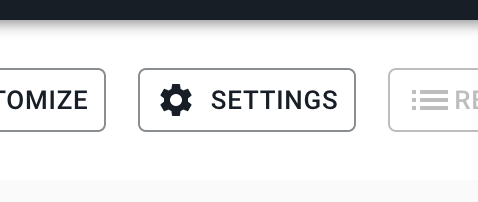
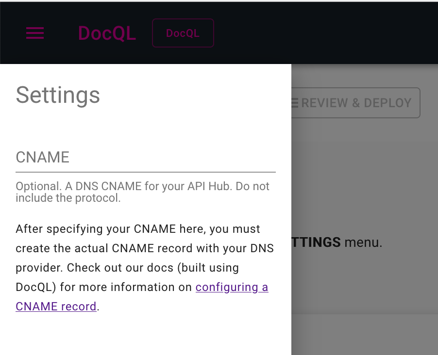
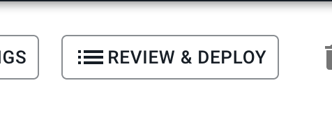
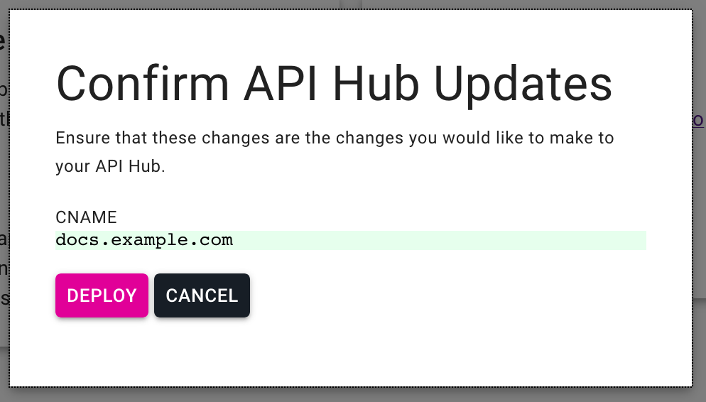

+++
title = "CNAME Setup"
weight = 0
+++

CNAME Setup
===========
Learn how to configure a CNAME for your API Hub.

By default, all API Hubs built in DocQL will receive a dedicated subdomain under the `hubs.docql.io` domain. These subdomains are fully encrypted with TLS using the ACME protocol with Let's Encrypt as the provider. This offers a great low-effort way for users to get started building their API Hubs and have immediate access to the built product. The exact URL is always provided in the DocQL web application in the API Hubs list & detail views.

Most teams will want to incorporate their API Hubs into their company's parent domain. We provide this integration using DNS CNAMEs. The steps to take to configure a CNAME for your API Hub a described briefly here. Each step is also broken down into more detail further into this guide.

- Using your DNS provider, configure a new CNAME record for your domain which points to `hubs.docql.io`. If you host your own DNS servers, the same applies. For example, if your domain is `example.com`, and you want your documentation API Hub to be available at `docs.example.com`, you will create a CNAME record for `docs.example.com` which points to `hubs.docql.io`.
- Once you have configured your CNAME record in your DNS provider, head on over to the API Hub details page for your API Hub and pop open the settings drawer. Here you should specify the value used for your DNS CNAME record. In our example so far, this would be `docs.example.com`.

What we want to do here is force all user hubs to fall under the hubs.docql.io, this will ensure that no customer subdomain would ever conflict with one of our own internal DocQL subdomains. No blacklisting needed.

### configuring a cname
Pro Tips:
- Be sure that you add your CNAME properly. Some DNS providers require that you specify only the subdomain which is being configured, not the full domain, or vice versa. For example, if only the subdomain should be specified, then in our `docs.example.com` example, configure you CNAME record for `docs` and point it to `hubs.docql.io`.

### docql cname settings
In the DocQL web app, navigate to the API Hub details page for your API Hub. The settings drawer is pictured here.

Click that settings button, and you should now see the settings drawer.

Enter the value used for your DNS CNAME record here, and once you are ready, press the reserve button.

Lastly, review the changes you are about to make.

Then deploy.

After you've triggered the deployment, the DocQL build system will apply the changes to our infrastructure, TLS certs will be provisioned for the new API Hub domain using the ACME protocol with Let's Encrypt and then your API Hub will be reachable at the newly configured address.

### troubleshooting
The DocQL platform uses a few safety mechanisms to ensure proper CNAME configuration. If CNAMEs are configured incorrectly, they can be difficult at times to diagnose where the problem may be depending on your experience level. Below are a few common issues which you may come across.

#### misconfigured cname
If a CNAME is misconfigured, the site will not be available at the configured at the desired CNAME address until its configuration issue is corrected. TLS configuration depends upon properly configured DNS as well.

#### dns propagation
It may take DNS modifications some time to propagate throughout the network. At times it may seem immediate, other times it may seem to take far too long. If a DNS CNAME is configured and deployed in DocQL, but the DNS changes have not propagated throughout the network, this will be indistignuishable from a misconfigured CNAME from the vantage point of the DocQL platform.

The rule of thumb is to manually check that your DNS modifications have propagated, and then to only apply the changes on the DocQL side after successful confirmation. There are many tools available online to aid on this front for all different network administration skill levels. For *nix systems, we would recommend `dig`.
